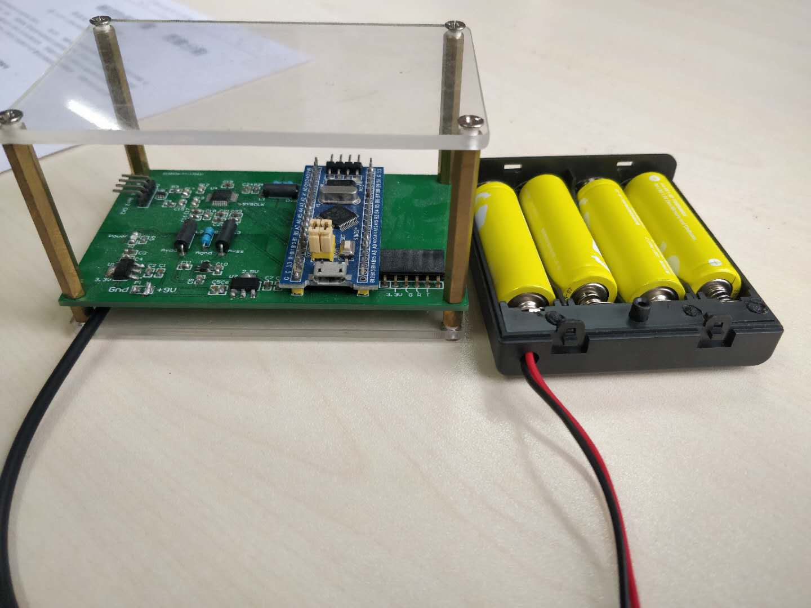
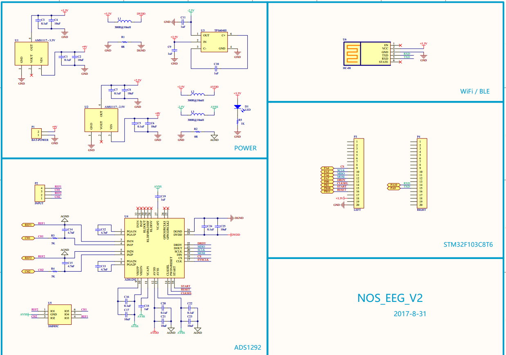

# OpenSSVEP

Software and hardware for a single channel BCI (Brain Computer Interface) based on SSVEP (Steady State Vision Evoked Potential).


[Youku video demo](https://v.youku.com/v_show/id_XMzA5NDg0MzY3Mg==.html)

## Motivation

This project was for 2017 National Undergraduate Biomedical Engineering Innovation Design Competition. This project shows the possiblity of low cost and somewhat convenient device for BCI based on OpenSSVEP. Further development may lead to a useable low cost SSVEP based BCI device, along with software targeted at all platform.

Highlights:

- Overall cost for hardware under 100CNY.
- easy to reproduce hardware design.
- The stimuli do not require strict blinking frequency timing.
- further investigation on data analysis method can improve detection accuracy.
- plug-in wireless modules

  use wifi or BLE or anything you like, with modification on embedded software

Hardware:







## Stimuli

## Detection algorithm

## Software

Software is composed of two part: real-time data analysis and stimuli presentation. Both are GUI software implemented with python kivy.

Further GUI development can shift to webGL or any web based technique.

### Denpendency Installation

This project is targeted at python3, so you would have to install python3 first.

1. Before installing required packages, install `wheel`.

```sh
$ pip install wheel
```

1. Install dependencies using requirement.txt:

```sh
$ pip install -r ./requirement.txt
```

1. Install kivy garden dependency of matplotlib.

```sh
$ garden install matplotlib --upgrade
```
